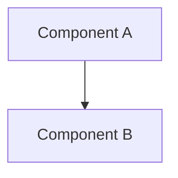

# Architecture

> High-level component map and interaction overview for {{REPO_NAME}}.

<!-- Last updated: {{DATE}} -->

## Overview

{{NARRATIVE}}

## Component Map

## Components

| Component | Responsibility |
|-----------|---------------|
| `ComponentA` | {{DESCRIPTION}} |

## Key Interaction Patterns

{{PATTERNS}}

## Source References

| Symbol / Concept | File | Lines |
|-----------------|------|-------|
