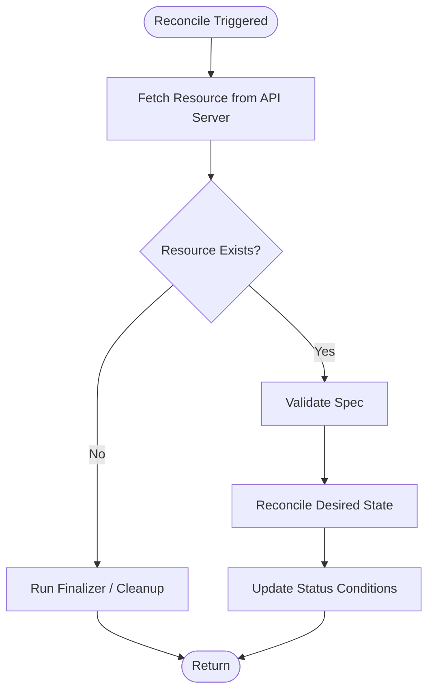

# {{GROUP_NAME}} Controllers

> {{ONE_LINE_DESCRIPTION}}

<!-- Last updated: {{DATE}} -->

## Overview

{{NARRATIVE — what this controller group manages, what API group it belongs to, and
its role within the operator.}}

## Controllers

| Controller | Watched Resources | Owned Resources |
|------------|-------------------|-----------------|
| `ControllerA` | `ResourceX`, `ResourceY` | `ResourceZ` |

## Reconciliation Logic

### ControllerA

**Trigger:** Changes to `ResourceX` or `ResourceY`.



**Requeue strategy:** {{DESCRIBE — e.g., exponential backoff on error, fixed interval
for polling, no requeue on success}}

### Status Conditions

| Condition | Meaning | Set By |
|-----------|---------|--------|
| `Ready` | {{DESCRIPTION}} | `ControllerA` |
| `Progressing` | {{DESCRIPTION}} | `ControllerA` |

### Events Emitted

| Event Type | Reason | When |
|------------|--------|------|
| `Normal` | `Created` | {{WHEN}} |
| `Warning` | `ReconcileError` | {{WHEN}} |

## Gherkin Scenarios

```gherkin
Feature: {{GROUP_NAME}} Reconciliation
  Background:
    Given the operator is running
    And the Kubernetes API server is reachable

  Scenario: Successful reconciliation of ResourceX
    Given a ResourceX exists in the cluster
    When the controller reconciles
    Then the desired state is applied
    And the status condition "Ready" is set to "True"
```

## Source References

| Symbol / Concept | File | Lines |
|-----------------|------|-------|
