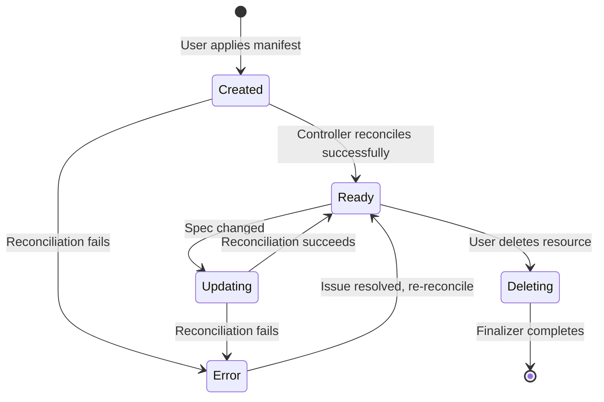

# {{CRD_NAME}}

> {{ONE_LINE_DESCRIPTION}}

<!-- Last updated: {{DATE}} -->

## Overview

{{NARRATIVE — what this CRD represents, which API group/version it belongs to, and
its purpose within the operator.}}

**API Group:** `{{GROUP}}`
**Version:** `{{VERSION}}`
**Kind:** `{{KIND}}`
**Scope:** `Namespaced` | `Cluster`

## Spec Fields

| Field | Type | Required | Default | Description |
|-------|------|----------|---------|-------------|
| `fieldA` | `string` | Yes | — | {{DESCRIPTION}} |
| `fieldB` | `int` | No | `10` | {{DESCRIPTION}} |

## Status Fields

| Field | Type | Description |
|-------|------|-------------|
| `conditions` | `[]Condition` | Standard Kubernetes conditions |
| `observedGeneration` | `int64` | Last generation reconciled |

## Validation Rules

- {{RULE — e.g., "fieldA must be a valid DNS name"}}
- {{RULE — e.g., "fieldB must be between 1 and 100"}}

## Defaulting

- {{DEFAULT — e.g., "If fieldB is omitted, it defaults to 10"}}

## Lifecycle

## Relationships

| Related Resource | Relationship | Description |
|-----------------|--------------|-------------|
| `OtherCRD` | References | {{DESCRIPTION}} |

## Source References

| Symbol / Concept | File | Lines |
|-----------------|------|-------|
