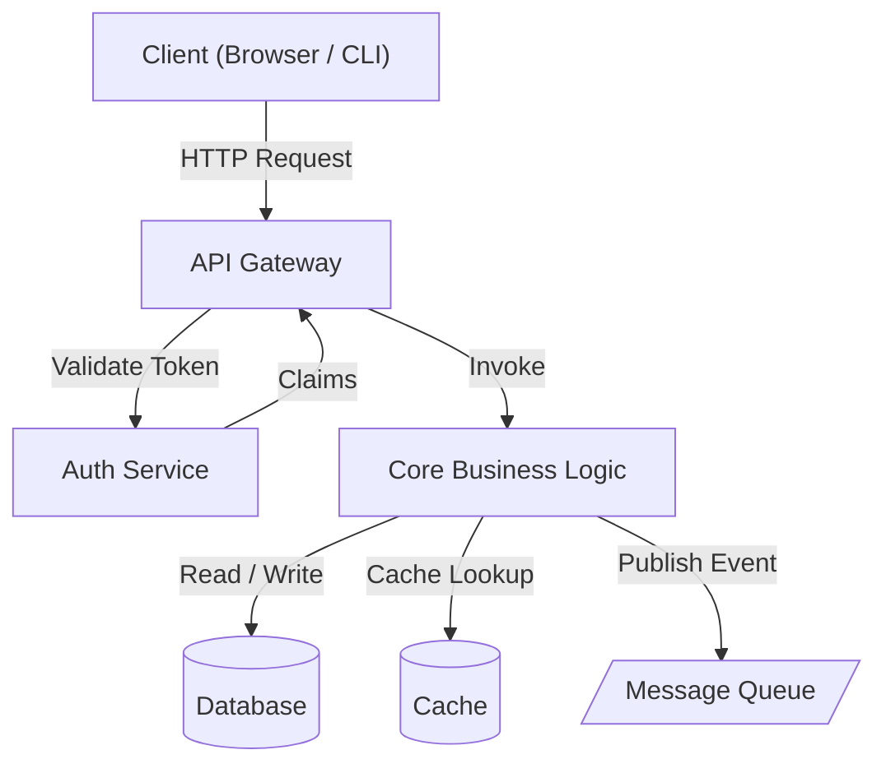
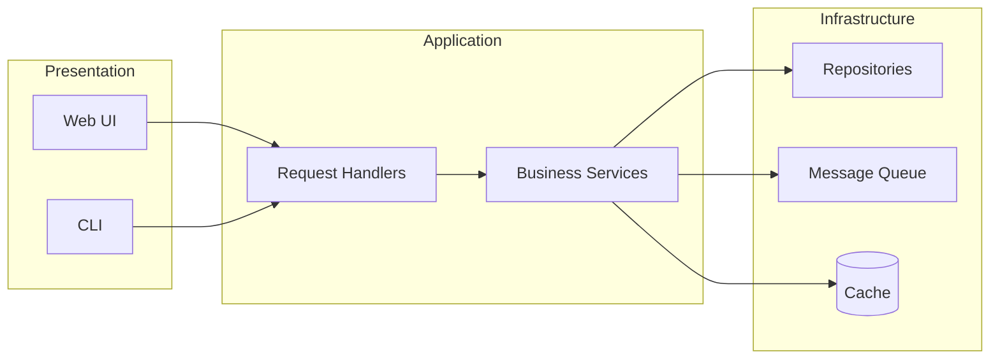
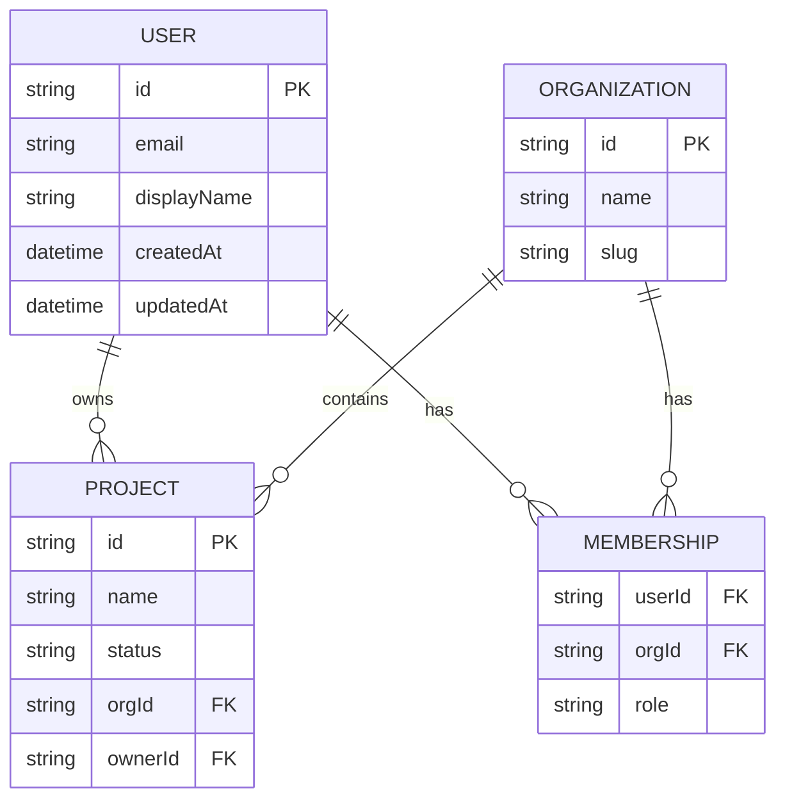
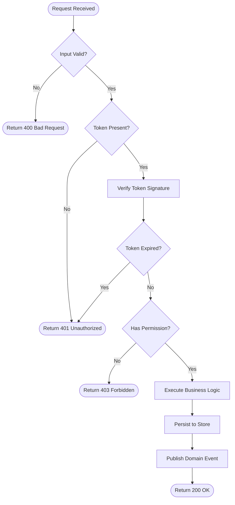
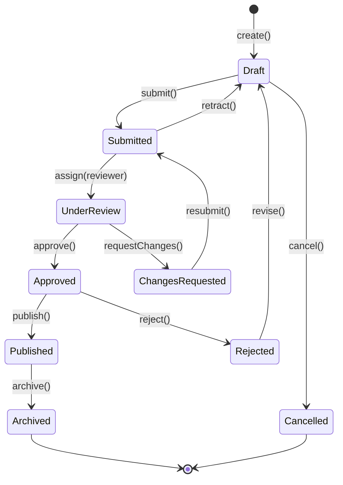
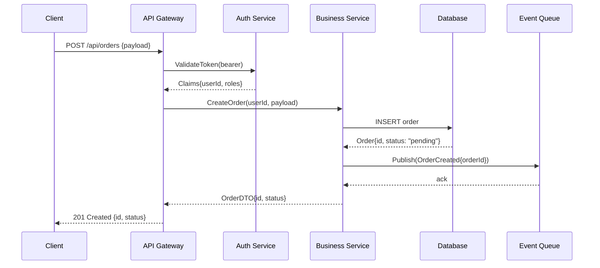

# Spec Format Reference

Canonical Mermaid and Gherkin examples for the `spec-synthesis` skill.
Copy these patterns directly into generated spec files.

---

## 1. Architecture Diagrams — `graph TD` / `graph LR`

Use `graph TD` (top-down) for layered architectures:

````markdown

````

Use `graph LR` (left-right) to show horizontal layering with subgraphs:

````markdown

````

---

## 2. Entity Relationship Diagrams — `erDiagram`

Use logical domain names, not database column names.
Cardinality notation: `||--||` (one-to-one), `||--o{` (one-to-many), `}o--o{` (many-to-many).

````markdown

````

---

## 3. Logic Flow Diagrams — `flowchart TD`

Use rounded rectangles for start/end (`([...])`), diamonds for decisions (`{...}`),
rectangles for actions (`[...]`).

````markdown

````

---

## 4. State Machine Diagrams — `stateDiagram-v2`

Use `stateDiagram-v2` for entity lifecycle or workflow state machines.

````markdown

````

---

## 5. Sequence Diagrams — `sequenceDiagram`

Use for documenting request/response flows between components.

````markdown

````

---

## 6. Gherkin Feature / Scenario Blocks

Use for behavioral specifications. Describe observable outcomes, not implementation.

````markdown
```gherkin
Feature: Order Creation
  As an authenticated customer
  I want to submit a new order
  So that my purchase is recorded and fulfillment begins

  Background:
    Given the user is authenticated with role "customer"
    And the product catalog is available

  Scenario: Successful order with valid items
    Given the cart contains 2 units of product "P-001"
    And the product "P-001" has sufficient inventory
    When the user submits the order
    Then the system creates an order in "pending" status
    And an "OrderCreated" event is published
    And the user receives a confirmation with an order ID

  Scenario: Order rejected due to insufficient inventory
    Given the cart contains 5 units of product "P-002"
    And the product "P-002" has only 3 units in inventory
    When the user submits the order
    Then the system returns a 409 Conflict error
    And the error message identifies "P-002" as the out-of-stock item
    And no order is created
    And no event is published

  Scenario: Order rejected for unauthenticated user
    Given the user is not authenticated
    When the user attempts to submit an order
    Then the system returns a 401 Unauthorized error
```
````

---

## 7. Pending Clarification Format

Emit this blockquote wherever logic cannot be determined from the code. Be specific
about what is ambiguous and what information would resolve it.

```markdown
> ⚠️ **Pending Clarification:** The retry logic in `PaymentService.processRefund()`
> references a `MAX_RETRIES` constant that is not defined in the observed codebase.
> It may be injected via an environment variable or a missing configuration file.
> **To resolve:** Confirm whether `PAYMENT_MAX_RETRIES` env var controls this limit,
> and document the backoff strategy (linear vs. exponential) and the behavior after
> the maximum is exceeded (dead-letter queue, alert, silent fail, etc.).
```

---

## 8. Source References Table

Every spec file must end with this section, listing the actual files and line ranges
examined when writing the spec. This makes specs auditable and falsifiable.

```markdown
## Source References

| Symbol / Concept | File | Lines |
|-----------------|------|-------|
| `OrderService` class | `src/services/order.service.ts` | 1–180 |
| `Order` domain model | `src/domain/order.ts` | 1–55 |
| `OrderCreated` event | `src/events/order.events.ts` | 12–28 |
| Order creation route | `src/routes/orders.router.ts` | 34–60 |
| Inventory check logic | `src/services/inventory.service.ts` | 88–115 |
```

---

## 9. Full Spec File Template

````markdown
# <Title>

> <One-sentence description of what this spec covers>

<!-- Last updated: YYYY-MM-DD -->

## Overview

<2–4 sentence narrative introduction to the scope of this spec file.>

## <Major Section 1>

<Content — Mermaid diagrams, tables, prose.>

> ⚠️ **Pending Clarification:** <if applicable>

## <Major Section 2>

<Content — Gherkin scenarios, flowcharts, etc.>

## Source References

| Symbol / Concept | File | Lines |
|-----------------|------|-------|
| `ExampleClass` | `src/example.ts` | 1–50 |
````
