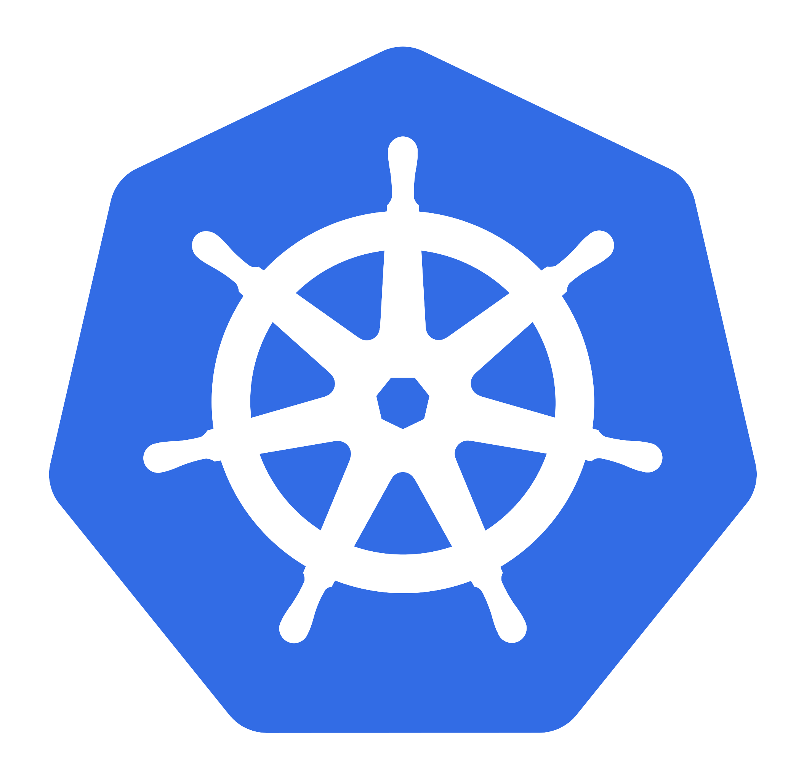

<p>
  <a href="https://ngrok.com">
    
  </a>
  <a href="https://kubernetes.io/">
  
  </a>
</p>

<p>
  <a href="https://github.com/ngrok/kubernetes-ingress-controller/actions?query=branch%3Amain+event%3Apush">
      
  </a>
  <a href="https://github.com/ngrok/kubernetes-ingress-controller/blob/master/LICENSE">
    
  </a>
  <a href="#features-and-beta-status">
    
  </a>
  <a href="https://ngrok.com/slack">
    
  </a>
  <a href="https://twitter.com/intent/follow?screen_name=ngrokHQ">
    
  </a>
</p>

# ngrok Kubernetes Ingress Controller


Leverage [ngrok](https://ngrok.com/) for your [Kubernetes Ingress](https://kubernetes.io/docs/concepts/services-networking/ingress/). Instantly add load balancing, authentication, and observability to your services via ngrok Cloud Edge modules using Custom Resource Definitions (CRDs) and Kubernetes-native tooling.

[Installation](#installation) | [Getting Started](https://ngrok.com/docs/using-ngrok-with/k8s/) | [Documentation](#documentation) | [Developer Guide](https://github.com/ngrok/kubernetes-ingress-controller/blob/main/docs/developer-guide/README.md) | [Known Issues](#known-issues)

## Installation

### Helm

> **Note** We recommend using the Helm chart to install the controller for a better experience through changes.

Add the ngrok Ingress Controller Helm chart:

```sh
helm repo add ngrok https://ngrok.github.io/kubernetes-ingress-controller
```

Then, install the latest version (setting the appropriate values for your environment):

```sh
export NAMESPACE=[YOUR_K8S_NAMESPACE]
export NGROK_AUTHTOKEN=[AUTHTOKEN]
export NGROK_API_KEY=[API_KEY]

helm install ngrok/kubernetes-ingress-controller \
  --generate-name \
  --namespace $NAMESPACE \
  --create-namespace \
  --set credentials.apiKey=$NGROK_API_KEY \
  --set credentials.authtoken=$NGROK_AUTHTOKEN
```

> **Note** The values for `NGROK_API_KEY` and `NGROK_AUTHTOKEN` can be found in your [ngrok dashboard](https://dashboard.ngrok.com/get-started/setup) and are used by your ingress controller to authenticate with ngrok for configuring and running your network ingress traffic at the edge.

For a more in-depth installation guide follow our step-by-step [Getting Started](https://ngrok.com/docs/using-ngrok-with/k8s/) guide.

### YAML Manifests

Apply the [sample combined manifest](manifest-bundle.yaml) from our repo:

```sh
kubectl apply -n ngrok-ingress-controller \
  -f https://raw.githubusercontent.com/ngrok/kubernetes-ingress-controller/main/manifest-bundle.yaml
```

For a more in-depth installation guide follow our step-by-step [Getting Started](https://ngrok.com/docs/using-ngrok-with/k8s/) guide.

## Documentation

You can find the full documentation for the ngrok Ingress Controller can be found [under the docs directory](./docs/README.md). Pull requests for corrections and additions are always welcomed.

###  Guides and Tutorials
- [Deployment Guide](./docs/deployment-guide/README.md): for installing the controller for the first time
- [User Guide](./docs/user-guide/README.md): for an in depth view of the ngrok ingress configuration options and primitives
- [Examples](./docs/examples/README.md): for examples of how to configure ingress in different scenarios (e.g. Hello World, Consul, OAuth, etc.)
- [Developer Guide](./docs/developer-guide/README.md): for those interested in contributing to the project


## Known Issues

> **Note** 
>
> This project is currently in beta as we continue testing and receiving feedback. The functionality and CRD contracts may change. It is currently used internally at ngrok for providing ingress to some of our production workloads. 

1. The ngrok Ingress Controller requires a ngrok Pro or Enterprise subscription.
1. Current issues of concern for production workloads are being tracked [here](https://github.com/ngrok/kubernetes-ingress-controller/issues/208) and [here](https://github.com/ngrok/kubernetes-ingress-controller/issues/219).

## Support

The best place to get support using the ngrok Ingress Controller is through the [ngrok Slack Community](https://ngrok.com/slack). If you find bugs or would like to contribute code, please follow the instructions in the [contributing guide](./docs/developer-guide/README.md).

## License

The ngrok ingress controller is licensed under the terms of the MIT license.

See [LICENSE](./LICENSE.txt) for details.
