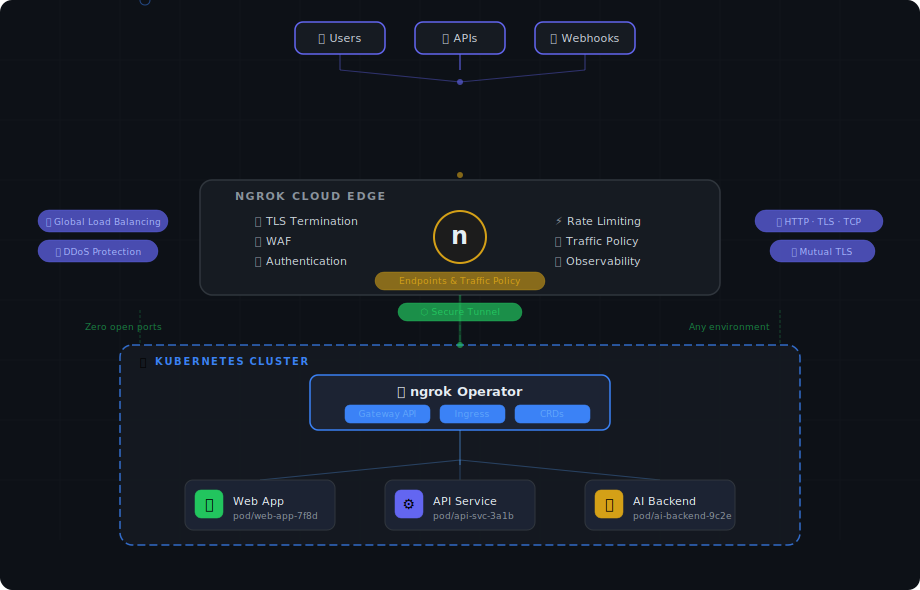

<h1 align="center">
  <br>
  <a href="https://ngrok.com/docs/k8s/">ngrok Kubernetes Operator</a>
  <br>
</h1>

<h4 align="center">Secure ingress for your Kubernetes services — powered by <a href="https://ngrok.com">ngrok</a></h4>

<!-- badges -->
<p align="center">
  <a href="https://github.com/ngrok/ngrok-operator/actions?query=branch%3Amain+event%3Apush">
    
  </a>
  <a href="https://github.com/ngrok/ngrok-operator/blob/master/LICENSE">
    
  </a>
  <a href="#features-and-beta-status">
    
  </a>
  <a href="#gateway-api-status">
    
  </a>
  <a href="https://ngrok.com/slack">
    
  </a>
  <a href="https://twitter.com/intent/follow?screen_name=ngrokHQ">
    
  </a>
  <a href="https://artifacthub.io/packages/search?repo=ngrok&operators=true&sort=relevance&page=1">
    
  </a>
</p>

<p align="center">
  Instantly add load balancing, authentication, and observability to your services via ngrok's cloud edge<br>
  using <a href="https://kubernetes.io/docs/concepts/services-networking/ingress/">Kubernetes Ingress</a>, the <a href="https://gateway-api.sigs.k8s.io/">Gateway API</a>, and Custom Resource Definitions.
</p>

<p align="center">
  <a href="https://ngrok.com">
    <picture>
      <source media="(prefers-color-scheme: dark)" srcset="docs/assets/images/architecture-banner.svg">
      <source media="(prefers-color-scheme: light)" srcset="docs/assets/images/architecture-banner.svg">
      
    </picture>
  </a>
</p>

<p align="center">
  <a href="#installation"><strong>Installation</strong></a> ·
  <a href="https://ngrok.com/docs/using-ngrok-with/k8s/"><strong>Getting Started</strong></a> ·
  <a href="#documentation"><strong>Docs</strong></a> ·
  <a href="https://github.com/ngrok/ngrok-operator/blob/main/docs/developer-guide/README.md"><strong>Developer Guide</strong></a> ·
  <a href="#known-issues"><strong>Known Issues</strong></a>
</p>

> **Note**
>
> The ngrok-operator is production-ready and supported for use in production environments. However, it is currently _`pre-1.0.0`_, and as such, the public API (including helm values and CRDs) should be considered unstable.
>
> While we aim to minimize disruption, breaking changes may be introduced in minor or patch releases prior to the `1.0.0` release. Users are encouraged to pin versions and review release notes when upgrading.

## Installation

### Helm

> **Note** We recommend using the Helm chart to install the operator for a better upgrade experience.

Add the ngrok Kubernetes Operator Helm chart:

```sh
helm repo add ngrok https://charts.ngrok.com
```

Then, install the latest version (setting the appropriate values for your environment):

```sh
export NAMESPACE=[YOUR_K8S_NAMESPACE]
export NGROK_AUTHTOKEN=[AUTHTOKEN]
export NGROK_API_KEY=[API_KEY]

helm install ngrok-operator ngrok/ngrok-operator \
  --namespace $NAMESPACE \
  --create-namespace \
  --set credentials.apiKey=$NGROK_API_KEY \
  --set credentials.authtoken=$NGROK_AUTHTOKEN
```

> ** Note ** The values for `NGROK_API_KEY` and `NGROK_AUTHTOKEN` can be found in your [ngrok dashboard] (https://dashboard.ngrok.com/get-started/setup). The ngrok Kubernetes Operator uses them to authenticate with ngrok and configure and run your network ingress traffic at the edge.

For a more in-depth installation guide follow our step-by-step [Getting Started](https://ngrok.com/docs/using-ngrok-with/k8s/) guide.

#### Gateway API

To enable using the ngrok-operator with the Kubernetes Gateway API, you need to install the Gateway CRDs if you haven't already, and then include `gateway.enabled` in your `helm --set` or `values.yaml`.

See the [Kubernetes Gateway API Quickstart](https://ngrok.com/docs/getting-started/kubernetes/gateway-api#standard) for setup and installation steps.

### YAML Manifests

Apply the [sample combined manifest](manifest-bundle.yaml) from our repo:

```sh
kubectl apply -n ngrok-operator \
  -f https://raw.githubusercontent.com/ngrok/ngrok-operator/main/manifest-bundle.yaml
```

For a more in-depth installation guide follow our step-by-step [Getting Started](https://ngrok.com/docs/using-ngrok-with/k8s/) guide.

## Documentation

The full documentation for the ngrok Kubernetes Operator can be found on our [k8s docs](https://ngrok.com/docs/k8s/)

### Uninstalling

For guidance on safely uninstalling the operator, including cleanup of ngrok API resources and finalizers, see the [Uninstall Guide](./docs/uninstall.md).

## Known Issues

1. Current issues can be found in the GitHub issues. [Known/suspected bugs](https://github.com/ngrok/ngrok-operator/issues?q=is%3Aopen+is%3Aissue+label%3Abug) are labeled as `bug`.

## Support

The best place to get support using the ngrok Kubernetes Operator is through the [ngrok Slack Community](https://ngrok.com/slack). If you find bugs or would like to contribute code, please follow the instructions in the [contributing guide](./docs/CONTRIBUTING.md).

## License

The ngrok Kubernetes Operator is licensed under the terms of the MIT license.

See [LICENSE](./LICENSE.txt) for details.
