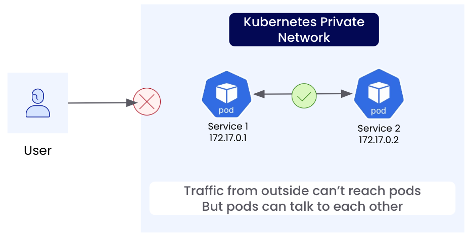
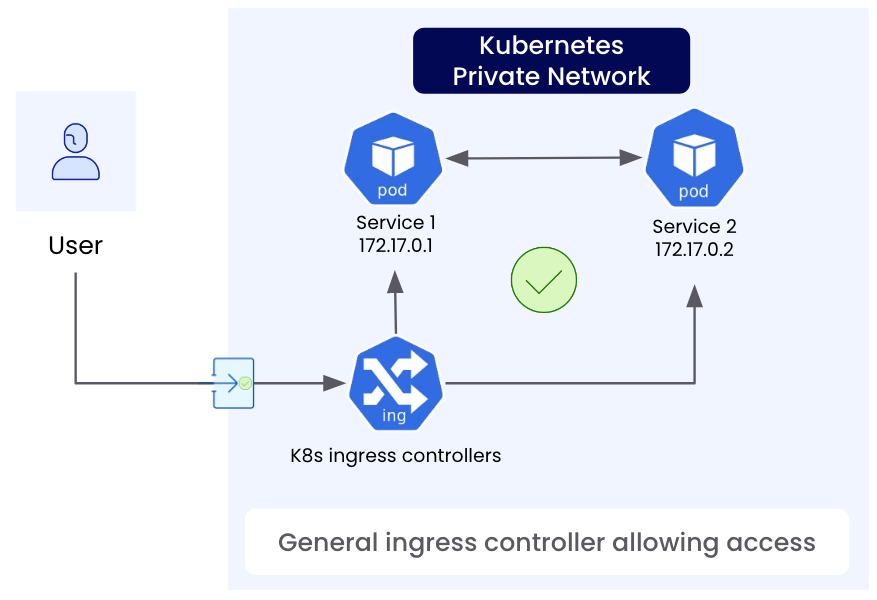
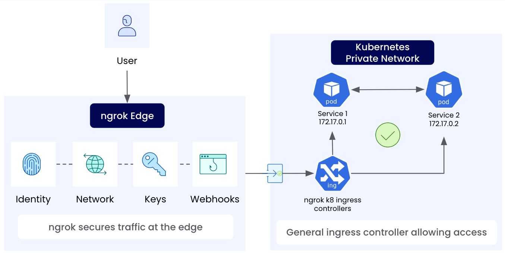

<p align="center">
  <a href="https://ngrok.com">
    
  </a>
  <a href="https://kubernetes.io/">
  
  </a>
</p>

# ngrok Kubernetes Ingress Controller Documentation

This is the ngrok ingress controller. It can be deployed and operated to a cluster and operated by a team allowing others to create ingress objects to dynamically self service ingress to their apps and services using a shared ngrok account. This is a great way to get started with ngrok and Kubernetes.

The controller watches for [Ingress](https://kubernetes.io/docs/concepts/services-networking/ingress/) objects and creates the corresponding ngrok tunnels and edges. More details on how these are derived can be found [here](./user-guide/ingress-to-edge-relationship.md). Other ngrok features such as TCP Edges can be configured via [CRDs](./user-guide/crds.md).

If you are looking to install the controller for the first time, see our [deployment-guide](./deployment-guide/README.md).
If it's already installed and you are looking to configure ingress for an app or service, see our [user-guide](./user-guide/README.md).

For more in depth guides, see here:
- [Deployment Guide](./deployment-guide/README.md)
- [User Guide](./user-guide/README.md)
- [Developer Guide](./developer-guide/README.md)
- [Examples](./examples/README.md)


# How It Works

A Kubernetes cluster has its own private network internally that pods get IP addresses from. This network is not accessible to the outside world. Kubernetes Ingress aims to solve getting traffic into the cluster. This should sound a bit similar to how ngrok helps get traffic to IPs behind a firewall on a private network.

By default, kubernetes offers similar types of approaches to exposing traffic as you'd expect at home:
- You can port forward: In kubernetes, this is a temporary solution using kubectl. At home, you can configure your router. Both may be disrupted if ip's change.
- You can use an external load balancer of some sort that still needs access to the internal network somehow.

In this case below, the user cannot access the pod directly in the k8s private network without some sort of entry point.



In kubernetes, ingress aims to solve this problem by letting various controllers implement the spec that provides a standard way of getting traffic into the cluster to access your application and service pods. This can be solved in different ways between controllers from exposing ports to external load balancers.



With ngrok, the controller establishes an outbound session that tunnels traffic over. The end user makes a connection to the ngrok edge, which routes traffic down to the controllers' agents and is forwarded to the pods in the cluster.



Once installed, a team can manage the shared controller component while other users or teams can self-service ingress to their services given the limitations imposed by the ngrok account and the controller operators.


To get started, an example ingress object such as this:

```yaml
apiVersion: networking.k8s.io/v1
kind: Ingress
metadata:
  name: example-ingress
  annotations:
    kubernetes.io/ingress.class: "ngrok"
spec:
  rules:
  - host: example.com
    http:
      paths:
      - path: /
        backend:
          serviceName: example-service
          servicePort: 80
```

This would create an edge on the ngrok account with the domain `example.com` and that routes traffic to a tunnel originating from the controller connecting ngrok to the kubernetes `example-service`.

_*Warning*_ If you have existing infrastructure, edges, or domains in your account, make sure to only create ingresses with new domains. Otherwise, you may overwrite existing edges and domains.


# Contributing

See our [Developer Guide](./developer-guide/README.md) for more information on how to contribute to the project.
