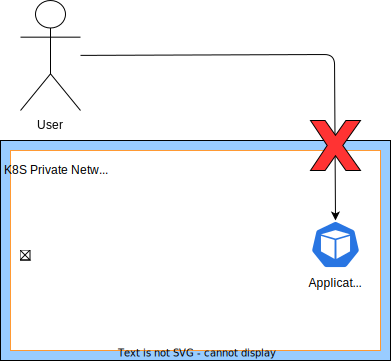

  
  

# ngrok Kubernetes Ingress Controller Documentation

This is the ngrok ingress controller. It can be deployed and operated to a cluster and operated by a team allowing others to create ingress objects to dynamically self service ingress to their apps and services using a shared ngrok account. This is a great way to get started with ngrok and Kubernetes.

The controller watches for [Ingress](http://kubernetes.io/docs/user-guide/ingress/) objects and creates the corresponding ngrok tunnels and edges. More details on how these are derived can be found [here](./user-guide/ingress-to-edge-relationship.md). Other ngrok features such as [TCP Edges](TODO) can be configured via [CRDs](TODO).

If you are looking to install the controller for the first time, see our [deployment-guide](./TODO).
If its already installed and you are looking to configure ingress for an app or service, see our [user-guide](./TODO).

# How It Works

The ngrok Kubernetes Ingress Controller implements the standard Kubernetes Ingress Spec in order to allow secure connections from the internet to services running in the Kubernetes private network that pods and Kubernetes services lie on.

- the path network traffic takes to get into the cluster through an established tunnel
- how k8s resources are read and converted into ngrok resources

- in k8s, its has its own private network which pods get ip addresses from and aren't accessible to the outside world
- k8s ingress aims to solve getting traffic into the cluster
- this should sound a bit similar to how ngrok helps get traffic to ip's behind a firewall on a private network
- basic picture of ngrok controller in k8s cluster
- create basic ingress object for a service, refer to more in depth ingress-to-edge-relationship.md

# Contributing
 - see [developer-guide](./TODO)

