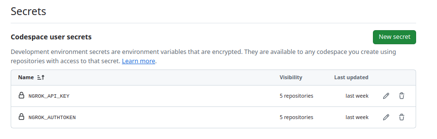

# Developer Guide

While this project is new and we don't have full contribution guidelines yet, we are open to any PRs and or issues raised. Feel free to reach out to us on slack as well!

- [In the weeds architecture](#in-the-weeds-architecture)
- [Local Development](#local-development)
    - [Codespaces](#codespaces)
    - [Non-Codespaces](#non-codespaces)
        - [Prerequisites](#prerequisites)
        - [Bootstrap repo-managed tools](#bootstrap-repo-managed-tools)
        - [Create a local kind cluster](#create-a-local-kind-cluster)
        - [Setup](#setup)
        - [Using the E2E Fixtures](#using-the-e2e-fixtures)
        - [E2E Tests](#e2e-tests)
- [Releasing](#releasing)

## In the weeds architecture

Have a look at the architecture guide on the internal workings of the ingress controller [here](./architecture.md)

## Local Development

### Codespaces

The ngrok-operator project includes a devcontainer configuration for GitHub Codespaces. The goal is to make contributing as easy as possible and to codify our development environment. If you open the repository in a codespace, all of the necessary tools will be pre-installed and available.

#### Set up Codespaces Secrets

The following environment variable secrets are required to develop and test the ngrok-operator in Codespaces:

* NGROK_API_KEY
* NGROK_AUTHTOKEN

You can create a ngrok API key in the ngrok Dashboard [here](https://dashboard.ngrok.com).
You can find your ngrok auth token [here](https://dashboard.ngrok.com/get-started/your-authtoken).

Follow [this guide](https://docs.github.com/en/codespaces/managing-your-codespaces/managing-your-account-specific-secrets-for-github-codespaces) to add these secrets
to your GitHub Account and allow them to be used with this repo.

When you are done, your [Codespaces Settings](https://github.com/settings/codespaces) should look something like this:



Make sure that the ngrok-operator repository, or your fork of it, is selected in the Visible Repositories list.

#### Start a Codespace

Once you've set up your Codespaces secrets, you can create a new Codespace for the repository by clicking the following button:

[](https://codespaces.new/ngrok/ngrok-operator)

This should open a new Codespace with all the necessary tools installed and print a welcome message in the terminal
explaining how to get started.

#### Issues

If you run into any issues with the Codespace setup, please open an issue in the repository using the
devenv template so we can address it.

### Non-Codespaces

#### Prerequisites

- [Docker Desktop](https://www.docker.com/products/docker-desktop/) (or any other container runtime that can run kind)
- [Go](https://go.dev/dl/)
- Optional but useful on your `$PATH`: [kubectl](https://kubernetes.io/docs/tasks/tools/) and [Helm](https://helm.sh/docs/intro/install/)

If you prefer declarative environments, the repository includes a `.envrc` that works with [nix-direnv](https://github.com/nix-community/nix-direnv); run `direnv allow` after installing it and the tooling above will be provided automatically.

#### Bootstrap repo-managed tools

```sh
make bootstrap-tools
```

This downloads the Go-based utilities the repo expects (kind, Helm, controller-gen, envtest, golangci-lint) into `./bin`. Make targets always invoke those exact binaries, so you don’t need to add `./bin` to your global `$PATH`; stick with the provided make commands. Install `helm`/`kubectl` separately if you want them available for manual use.

#### Create a local kind cluster

By default we create a cluster named `ngrok-operator` and our CI and Makefiles are configured to load images into this specific cluster.

```sh
make kind-create
```

This installs kind (if necessary) and provisions the cluster. Use `make kind-delete` to tear it down and `make kind-logs` to collect diagnostic bundles.

> NOTE: `kind create cluster` requires Docker to be running. If you prefer a different Kubernetes distribution (e.g. minikube), ensure your `kubectl` context points at it and that locally-built images are visible to the cluster before deploying.

#### Setup

```sh
export NGROK_API_KEY=<YOUR Secret API KEY>
export NGROK_AUTHTOKEN=<YOUR Secret Auth Token>
# kubectl can connect to your cluster and images built locally are available to the cluster
kubectl create namespace ngrok-operator
kubectl config set-context --current --namespace=ngrok-operator

make deploy
```

> Note: `make deploy*` loads the freshly built controller image into your kind cluster and sets a `redeployTimestamp` pod annotation each run, so Docker must be running locally and the controller pods always pick up the new image.

#### Using the E2E Fixtures

Several examples are provided in the [`e2e-fixtures` folder](https://github.com/ngrok/ngrok-operator/tree/main/e2e-fixtures). To use an example, make a copy of the included `EXAMPLE*config.yaml` in the same directory, like this:

- `cp e2e-fixtures/hello-world-ingress/EXAMPLE-config.yaml e2e-fixtures/hello-world-ingress/config.yaml`
- `cp e2e-fixtures/ingress-class/EXAMPLE-config-different.yaml e2e-fixtures/ingress-class/config-different.yaml`

Then, you need to update the `value` field in that new file.

You can then apply the given example via `kubectl apply -k e2e-fixtures/<example in question>`, i.e.
`kubectl apply -k e2e-fixtures/hello-world-ingress`.

#### E2E Tests

If you run the script `./scripts/e2e.sh` it will run the e2e tests against your current kubectl context. These tests tear down any existing ingress controller and examples, re-installs them, and then runs the tests. It creates a set of different ingresses and verifies that they all behave as expected

## Releasing

Please see the [release guide](./releasing.md) for more information on how to release a new version of the ingress controller.
