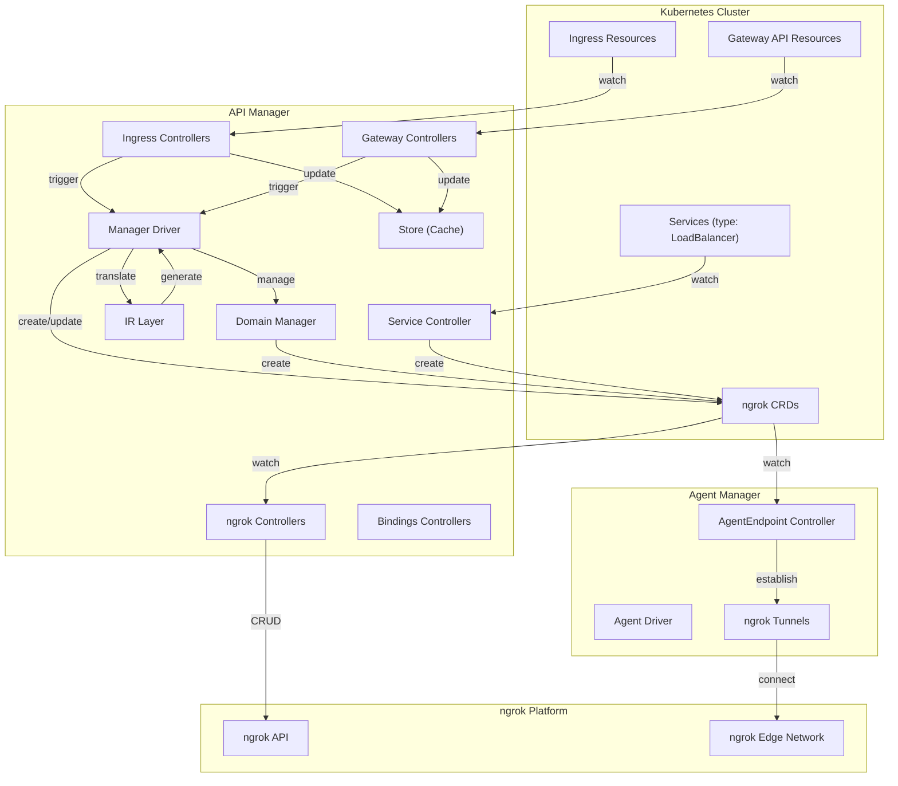

# Architecture

> High-level component map and interaction patterns for the ngrok Kubernetes Operator.

<!-- Last updated: 2026-04-08 -->

## Overview

The ngrok Kubernetes Operator is a controller-runtime based operator that integrates Kubernetes networking primitives (Ingress, Gateway API, Services) with the ngrok platform. It watches Kubernetes resources, translates them into an intermediate representation, and materializes them as ngrok endpoint CRDs (CloudEndpoint, AgentEndpoint) which are then synced to the ngrok API.

The operator runs as three separate binaries (deployments), each hosting a distinct set of controllers:

| Binary | Command | Role |
|--------|---------|------|
| **API Manager** | `api-manager` | Runs the majority of controllers: Ingress, Gateway API, Service, CloudEndpoint, Domain, IPPolicy, KubernetesOperator, NgrokTrafficPolicy, and optionally Bindings controllers. Coordinates the Manager Driver for resource translation and sync. |
| **Agent Manager** | `agent-manager` | Runs the AgentEndpoint controller. Establishes ngrok agent tunnels for each AgentEndpoint resource, forwarding traffic to upstream Kubernetes Services. |
| **Bindings Forwarder** | `bindings-forwarder-manager` | Runs the Forwarder and BoundEndpoint controllers for ngrok endpoint bindings (in-development feature). |

## Component Diagram

## Key Interaction Patterns

### Resource Translation Pipeline

The primary flow for Ingress and Gateway API resources follows a multi-stage translation pipeline:

1. **Watch & Cache**: Ingress or Gateway controllers watch their respective Kubernetes resources and update the in-memory Store.
2. **Trigger Sync**: On any change, the Manager Driver's `Sync()` method is invoked.
3. **Translate to IR**: The Driver calls translators (`translate_ingresses.go`, `translate_gatewayapi.go`) to convert Kubernetes resources into IR (Intermediate Representation) structures — `IRVirtualHost`, `IRRoute`, `IRDestination`.
4. **Materialize Endpoints**: The Driver converts IR structures into CloudEndpoint and/or AgentEndpoint CRDs, applying the chosen mapping strategy (collapsed vs. verbose).
5. **Reconcile to ngrok API**: The CloudEndpoint and AgentEndpoint controllers pick up these CRDs and reconcile them against the ngrok API.
6. **Establish Tunnels**: The Agent Manager watches AgentEndpoint resources and establishes ngrok tunnels to the upstream Kubernetes Services.

### Direct CRD Usage

Users can also create CloudEndpoint, AgentEndpoint, Domain, IPPolicy, and NgrokTrafficPolicy CRDs directly. These are reconciled by their respective controllers without going through the translation pipeline.

### Service LoadBalancer Flow

The Service controller watches Services with `loadBalancerClass: ngrok` and directly creates CloudEndpoint/AgentEndpoint resources. See `specs/controllers/service.md` for details.

### Mapping Strategies

The IR layer supports two endpoint mapping strategies that affect how Kubernetes resources are materialized into ngrok endpoints:

| Strategy | Annotation Value | Behavior |
|----------|-----------------|----------|
| **Collapsed** (default) | `endpoints` | When a hostname routes to a single upstream, creates one public AgentEndpoint (cost-effective at low replica counts). When multiple upstreams exist, creates a CloudEndpoint + internal AgentEndpoints. |
| **Verbose** | `endpoints-verbose` | Always creates a CloudEndpoint per hostname and an internal AgentEndpoint per unique upstream (cost-effective at higher replica counts). |

## Package Map

| Package | Classification | Description |
|---------|---------------|-------------|
| `cmd/` | Config/Ops | CLI commands and binary entry points (`api-manager`, `agent-manager`, `bindings-forwarder-manager`) |
| `api/` | Data Layer | CRD type definitions organized by API group (`bindings`, `ingress`, `ngrok`, `common`) |
| `internal/controller/` | Core Logic | All controller reconciliation logic, grouped by feature area |
| `internal/controller/labels/` | Core Logic | Controller instance identification via labels |
| `internal/store/` | Core Logic | In-memory cache layer (client-go `cache.Store`) for Ingress/Gateway resources |
| `internal/ir/` | Core Logic | Intermediate Representation for translating K8s resources to ngrok endpoints |
| `internal/trafficpolicy/` | Core Logic | Traffic policy DSL types and builders |
| `internal/domain/` | Core Logic | Domain CRD lifecycle management |
| `internal/drain/` | Core Logic | Graceful shutdown and finalizer removal during operator uninstall |
| `internal/ngrokapi/` | API Surface | Typed wrapper around the `ngrok-api-go` client library |
| `internal/annotations/` | Core Logic | Annotation constants and parsers for ngrok-specific annotations |
| `internal/resolvers/` | Core Logic | Secret and IP policy resolution abstractions |
| `internal/errors/` | Core Logic | Domain-specific error types |
| `internal/healthcheck/` | Config/Ops | Liveness/readiness health check interfaces |
| `internal/mux/` | Core Logic | Protobuf message framing for binding connections |
| `internal/util/` | Core Logic | Shared utilities (finalizers, URL parsing, K8s helpers) |
| `pkg/agent/` | Core Logic | Agent tunnel driver — establishes ngrok tunnels for AgentEndpoints |
| `pkg/managerdriver/` | Core Logic | Manager Driver — orchestrates Store, IR translation, and endpoint materialization |
| `pkg/bindingsdriver/` | Core Logic | Bindings driver for forwarding bound endpoint traffic |
| `helm/` | Config/Ops | Helm charts (`ngrok-operator` and `ngrok-crds`) |
| `tools/make/` | Config/Ops | Modular Makefile targets |

## Source References

| Symbol / Concept | File | Lines |
|-----------------|------|-------|
| API Manager command | `cmd/api-manager.go` | 1–120 |
| Agent Manager command | `cmd/agent-manager.go` | — |
| Bindings Forwarder command | `cmd/bindings-forwarder-manager.go` | — |
| Manager Driver | `pkg/managerdriver/driver.go` | 1–100 |
| Store interface | `internal/store/store.go` | 40–75 |
| IR types | `internal/ir/ir.go` | 1–105 |
| Base controller | `internal/controller/base_controller.go` | 42–132 |
| Domain Manager | `internal/domain/manager.go` | 73–96 |
| ngrok API Clientset | `internal/ngrokapi/clientset.go` | 15–22 |
