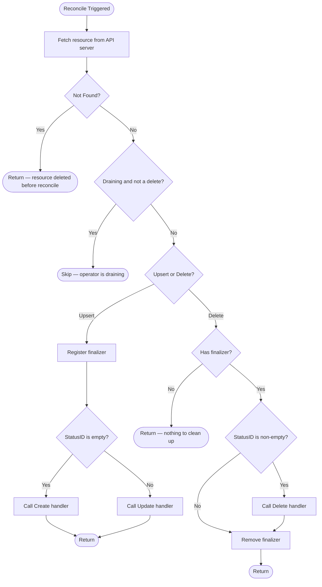

# Common Controller Patterns

> Shared reconciliation framework, utilities, and conventions used across all controllers.

<!-- Last updated: 2026-04-08 -->

## Overview

All controllers in the ngrok Operator are built on controller-runtime and share a common set of patterns for reconciliation, error handling, finalizer management, and event recording. This file documents those shared patterns so individual controller specs can focus on their unique logic.

## Base Controller Framework

The `BaseController[T]` generic struct (`internal/controller/base_controller.go`) provides a standard reconciliation pattern for controllers that manage a single CRD and its corresponding ngrok API resource.

### Reconciliation Flow

### Create vs. Update Determination

The `StatusID` function returns the ID of the ngrok API resource (e.g., the endpoint ID). When empty, the resource has not yet been created in the ngrok API, so `Create` is called. Otherwise, `Update` is called.

### Error Handling

`CtrlResultForErr` maps ngrok API errors to controller-runtime results:

| Error Type | Behavior |
|-----------|----------|
| ngrok 5xx errors | Requeue with error (exponential backoff) |
| 429 Too Many Requests | Requeue after 1 minute (no error) |
| 404 Not Found | Requeue with error |
| Failed CSR creation | Requeue after 30 seconds |
| Failed service creation | Requeue after 1 minute |
| Endpoint denied | No requeue (poller handles) |
| Other 4xx client errors | No requeue (terminal) |
| Status update error | Requeue after 10 seconds |

### Status Reconciliation

`ReconcileStatus` updates the resource's status subresource and wraps errors in a `StatusError` type that triggers a 10-second requeue.

## Finalizer Convention

All operator-managed resources use a single finalizer: `k8s.ngrok.com/finalizer`.

- **Added** during the first successful upsert reconcile via `util.RegisterAndSyncFinalizer`.
- **Removed** after the delete handler completes via `util.RemoveAndSyncFinalizer`.
- During drain, non-delete reconciles are skipped to prevent adding new finalizers.

## Controller Labels

The `internal/controller/labels` package provides controller instance identification:

| Label | Purpose |
|-------|---------|
| `k8s.ngrok.com/controller-name` | Name of the controller deployment |
| `k8s.ngrok.com/controller-namespace` | Namespace of the controller deployment |

These labels are applied to operator-created resources (like Domain CRDs) to enable filtering by operator instance in multi-tenant clusters.

## Drain State

All controllers accept a `DrainState` that signals when the operator is shutting down. During drain:
- Non-delete reconciles return immediately without processing.
- The Manager Driver's `Sync()` returns early.
- The `Drainer` iterates all resources with finalizers and either deletes them (Delete policy) or removes finalizers (Retain policy).

## Event Recording

Controllers use the `events.EventRecorder` to emit Kubernetes events:
- `Normal` events: `Creating`, `Created`, `Updating`, `Updated`, `Deleting`, `Deleted`, `Status`.
- `Warning` events: `CreateError`, `UpdateError`, `DeleteError`, `StatusError`, `ConfigError`.

## Manager Driver Integration

Controllers for Ingress, Gateway API, and related resources do not directly call the ngrok API. Instead, they update the in-memory Store and trigger the Manager Driver's `Sync()` method. The Driver handles IR translation and endpoint materialization.

The `managerdriver.HandleSyncResult()` helper converts Driver sync results into `ctrl.Result` values.

## Source References

| Symbol / Concept | File | Lines |
|-----------------|------|-------|
| `BaseController[T]` | `internal/controller/base_controller.go` | 42–67 |
| `Reconcile()` | `internal/controller/base_controller.go` | 70–132 |
| `CtrlResultForErr()` | `internal/controller/base_controller.go` | 171–200 |
| Controller labels | `internal/controller/labels/controller.go` | — |
| Finalizer utilities | `internal/util/k8s.go` | — |
| Drain state | `internal/drain/state.go` | — |
