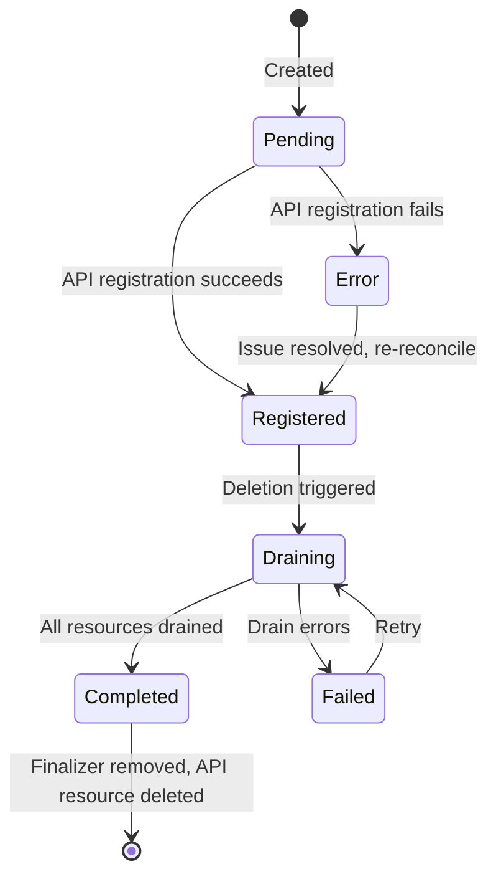

# KubernetesOperator

> Represents the operator's registration with the ngrok API, managing feature enablement, bindings, and drain lifecycle.

<!-- Last updated: 2026-04-08 -->

## Overview

The `KubernetesOperator` CRD is typically a singleton that registers this operator instance with the ngrok API. It controls which features are enabled (ingress, gateway, bindings), manages TLS certificates for bindings, and orchestrates the drain workflow during uninstall.

**API Group:** `ngrok.k8s.ngrok.com`
**Version:** `v1alpha1`
**Kind:** `KubernetesOperator`
**Scope:** Namespaced

## Spec Fields

| Field | Type | Required | Default | Description |
|-------|------|----------|---------|-------------|
| `description` | `string` | No | `"Created by ngrok-operator"` | Human-readable description |
| `metadata` | `string` | No | `"{"owned-by":"ngrok-operator"}"` | JSON arbitrary data |
| `enabledFeatures` | `[]string` | No | — | Features to enable: `ingress`, `gateway`, `bindings` |
| `region` | `string` | No | `"global"` | Region for ingress |
| `deployment.name` | `string` | No | — | Operator deployment name |
| `deployment.namespace` | `string` | No | — | Operator deployment namespace |
| `deployment.version` | `string` | No | — | Operator version |
| `binding.endpointSelectors` | `[]string` | Yes (if bindings) | — | CEL expressions for endpoint selection |
| `binding.ingressEndpoint` | `*string` | No | — | Public ingress endpoint URL |
| `binding.tlsSecretName` | `string` | Yes (if bindings) | `"default-tls"` | TLS secret name for binding connections |
| `drain.policy` | `DrainPolicy` | No | `Retain` | Drain policy: `Delete` (clean up ngrok API resources) or `Retain` (remove finalizers only) |

## Status Fields

| Field | Type | Description |
|-------|------|-------------|
| `id` | `string` | ngrok API operator identifier |
| `uri` | `string` | ngrok API URI |
| `registrationStatus` | `string` | `pending`, `registered`, or `error` |
| `registrationErrorCode` | `string` | Pattern `ERR_NGROK_XXXX` |
| `errorMessage` | `string` | Free-form error message (max 4096 chars) |
| `enabledFeatures` | `string` | String representation of enabled features |
| `bindingsIngressEndpoint` | `string` | URL for bindings ingress communication |
| `drainStatus` | `DrainStatus` | `pending`, `draining`, `completed`, `failed` |
| `drainMessage` | `string` | Additional drain info |
| `drainProgress` | `string` | Format `X/Y` (processed/total) |
| `drainErrors` | `[]string` | Most recent drain errors |

## Lifecycle

## Source References

| Symbol / Concept | File | Lines |
|-----------------|------|-------|
| KubernetesOperator types | `api/ngrok/v1alpha1/kubernetesoperator_types.go` | — |
| KubernetesOperator controller | `internal/controller/ngrok/kubernetesoperator_controller.go` | — |
| Drain types | `api/ngrok/v1alpha1/kubernetesoperator_types.go` | — |
