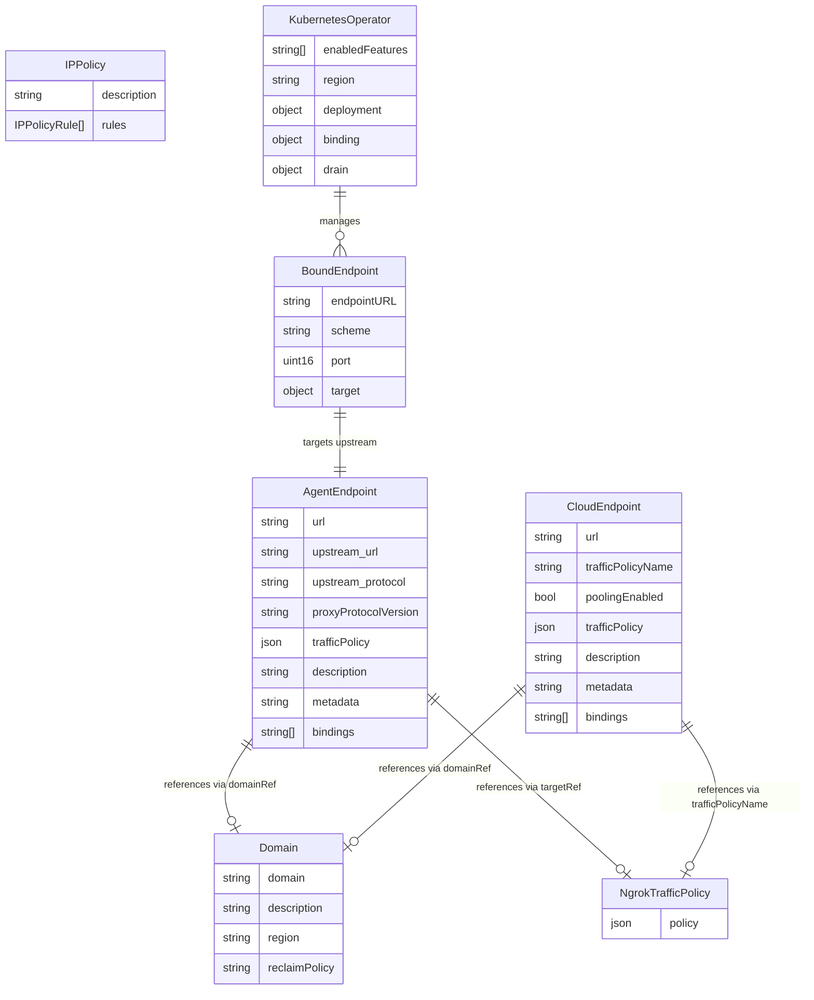

# Data Schema

> Logical data model covering all CRD entities, their attributes, and relationships.

<!-- Last updated: 2026-04-08 -->

## Overview

The ngrok Operator defines 7 Custom Resource Definitions (CRDs) across 3 API groups, plus a shared common types package. The Kubernetes API server is the authoritative data store — the operator maintains no additional persistent state beyond the standard controller-runtime client cache.

## API Groups

| API Group | Package | CRDs |
|-----------|---------|------|
| `ngrok.k8s.ngrok.com/v1alpha1` | `api/ngrok/v1alpha1` | AgentEndpoint, CloudEndpoint, KubernetesOperator, NgrokTrafficPolicy |
| `ingress.k8s.ngrok.com/v1alpha1` | `api/ingress/v1alpha1` | Domain, IPPolicy |
| `bindings.k8s.ngrok.com/v1alpha1` | `api/bindings/v1alpha1` | BoundEndpoint |
| `common/v1alpha1` (shared types) | `api/common/v1alpha1` | — (enums and constants only) |

## Entity Relationship Diagram

## Shared Types

Defined in `api/common/v1alpha1/common_types.go` and `api/ngrok/v1alpha1/common_types.go`:

| Type | Values / Fields | Used By |
|------|-----------------|---------|
| `ApplicationProtocol` | `http1`, `http2` | `AgentEndpoint.Spec.Upstream.Protocol` |
| `ProxyProtocolVersion` | `1`, `2` | `AgentEndpoint.Spec.Upstream.ProxyProtocolVersion` |
| `DefaultClusterDomain` | `svc.cluster.local` | Upstream URL construction |
| `K8sObjectRef` | `Name` (required) | Traffic policy references |
| `K8sObjectRefOptionalNamespace` | `Name`, `Namespace` (optional) | Domain refs, client cert refs |
| `EndpointWithDomain` | Interface: `GetURL()`, `GetBindings()`, `GetDomainRef()`, `SetDomainRef()`, `GetConditions()` | Domain Manager operates on this interface |

## Cross-Cutting Patterns

### Status Conditions

All CRDs except NgrokTrafficPolicy and KubernetesOperator use standard `[]metav1.Condition`. Common condition types:

| Condition | Set By | Meaning |
|-----------|--------|---------|
| `Ready` | Various controllers | Resource has been successfully reconciled with the ngrok API |
| `DomainReady` | Domain Manager | The associated Domain CRD is ready |

KubernetesOperator uses a custom `registrationStatus` field (`pending`, `registered`, `error`) instead of conditions.

### Finalizers

All resources managed by the operator use the finalizer `k8s.ngrok.com/finalizer` to ensure proper cleanup of ngrok API resources on deletion.

### Bindings

AgentEndpoint and CloudEndpoint both support a `bindings` field (max 1 item) with values: `public`, `internal`, or `kubernetes`. This determines where the endpoint is reachable.

### Domain Reference

AgentEndpoint and CloudEndpoint both have a `status.domainRef` field pointing to the associated Domain CRD. This is nil for TCP, internal, and Kubernetes-bound endpoints.

## Source References

| Symbol / Concept | File | Lines |
|-----------------|------|-------|
| AgentEndpoint types | `api/ngrok/v1alpha1/agentendpoint_types.go` | — |
| CloudEndpoint types | `api/ngrok/v1alpha1/cloudendpoint_types.go` | — |
| KubernetesOperator types | `api/ngrok/v1alpha1/kubernetesoperator_types.go` | — |
| NgrokTrafficPolicy types | `api/ngrok/v1alpha1/ngroktrafficpolicy_types.go` | — |
| Domain types | `api/ingress/v1alpha1/domain_types.go` | — |
| IPPolicy types | `api/ingress/v1alpha1/ippolicy_types.go` | — |
| BoundEndpoint types | `api/bindings/v1alpha1/boundendpoint_types.go` | — |
| Common types (shared) | `api/common/v1alpha1/common_types.go` | — |
| Common types (ngrok) | `api/ngrok/v1alpha1/common_types.go` | — |
