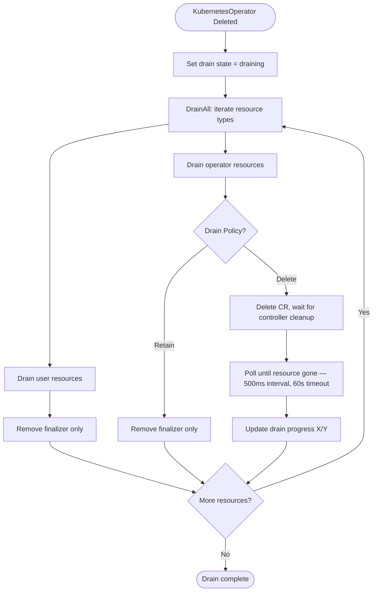

# Drain Orchestration

> Graceful shutdown workflow that removes finalizers and optionally deletes ngrok API resources during operator uninstall.

<!-- Last updated: 2026-04-08 -->

## Overview

The drain system (`internal/drain`) handles graceful operator uninstall by cleaning up all operator-managed resources. It is triggered when the `KubernetesOperator` CRD is deleted and runs as part of that deletion's reconciliation loop.

## Drain Policies

| Policy | Behavior |
|--------|----------|
| `Delete` | Deletes operator-created CRDs, allowing their controllers to clean up ngrok API resources. Waits for full deletion (finalizer removal by controller). |
| `Retain` | Only removes finalizers from resources without deleting them. Preserves ngrok API resources. |

## Drain Workflow

## Resource Processing Order

The drain processes resources in a specific order to respect dependencies:

**User resources (finalizer removal only):**
1. HTTPRoute
2. TCPRoute
3. TLSRoute
4. Ingress
5. Service
6. Gateway

**Operator resources (delete or retain based on policy):**
7. CloudEndpoint
8. AgentEndpoint
9. Domain
10. IPPolicy
11. BoundEndpoint

User resources have their finalizers removed first so they are not blocked during CRD uninstallation. Operator resources are processed second — in Delete mode, each deletion waits for the controller to complete its cleanup (which includes ngrok API deletion) before moving on.

Gateway API resources (HTTPRoute, TCPRoute, TLSRoute, Gateway) use `skipNoMatch: true` to gracefully handle clusters where the Gateway API CRDs are not installed.

## Drain State

The `DrainState` interface (`internal/drain/state.go`) is checked by all controllers:
- When draining, non-delete reconciles are skipped to prevent adding new finalizers.
- The Manager Driver's `Sync()` returns early during drain.
- The `BoundEndpointPoller` stops creating new resources.

## Progress Tracking

The `KubernetesOperator` status tracks drain progress:
- `drainStatus`: `pending` → `draining` → `completed` / `failed`
- `drainProgress`: Format `X/Y` (processed/total resources)
- `drainErrors`: Array of the most recent error strings
- `drainMessage`: Additional context

## Source References

| Symbol / Concept | File | Lines |
|-----------------|------|-------|
| Drainer struct | `internal/drain/drain.go` | 49–54 |
| DrainAll | `internal/drain/drain.go` | 106–141 |
| drainUserResource | `internal/drain/drain.go` | 143–149 |
| drainOperatorResource | `internal/drain/drain.go` | 151–184 |
| waitForDeletion | `internal/drain/drain.go` | 187–205 |
| Drain state | `internal/drain/state.go` | — |
| Drain orchestrator | `internal/drain/orchestrator.go` | — |
